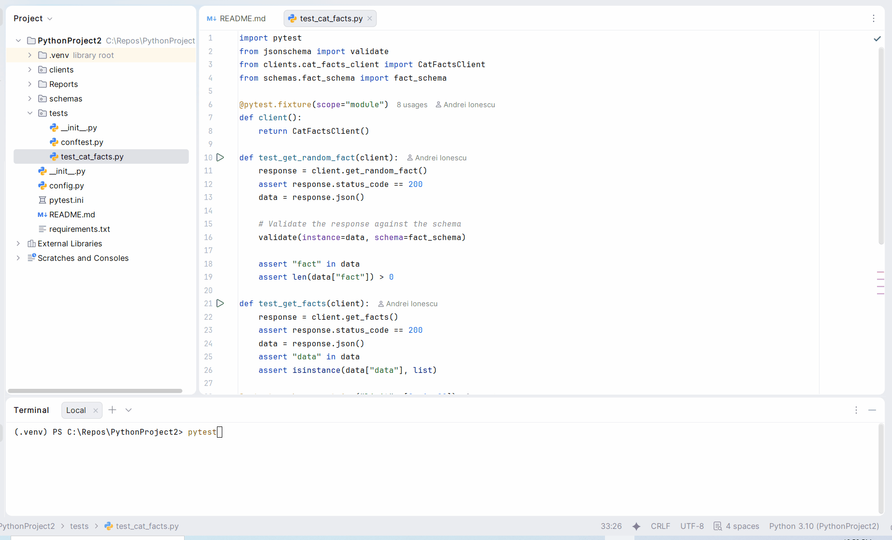

# Cat Facts API Test Automation Framework

This project provides an automated test framework for the [Cat Facts API](https://alexwohlbruck.github.io/cat-facts/).

## Framework Features

*   **Pytest Framework**: Uses `pytest` for robust and scalable test creation.
*   **API Client**: A dedicated `CatFactsClient` abstracts API interactions, leading to cleaner and more maintainable tests.
*   **Configuration Management**: A central `config.py` for managing environment details like the base URL.
*   **Response Schema Validation**: Uses `jsonschema` to validate the structure and data types of API responses, ensuring contract adherence.
*   **Automated HTML Reporting**: Automatically generates a unique, timestamped HTML report for each test run in the `Reports/` directory.
*   **Centralized Logging**: The API client handles logging of all requests and responses, keeping test code clean.

## Test Cases

The following test cases are included:

| Test Case | Description | Validation |
|---|---|---|
| `test_get_random_fact` | Retrieves a random cat fact. | - Asserts status code is 200.<br>- Validates the response against a JSON schema (`fact_schema`). |
| `test_get_facts` | Retrieves a list of cat facts. | - Asserts status code is 200.<br>- Asserts the response `data` is a list. |
| `test_get_facts_with_limit` | Retrieves a list of facts with a `limit` parameter. Uses `pytest.mark.parametrize` to test with values `[0, 1, 20]`. | - Asserts status code is 200.<br>- Asserts the number of returned facts matches the `limit`. |
| `test_get_breeds` | Retrieves a list of cat breeds. | - Asserts status code is 200.<br>- Asserts the response `data` is a list. |

## How to Run Tests

1.  **Install Dependencies**:
    ```sh
    pip install -r requirements.txt
    ```

2.  **Run Tests**:
    ```sh
    pytest
    ```

    A new, HTML report will be automatically generated in the `Reports/` directory.

